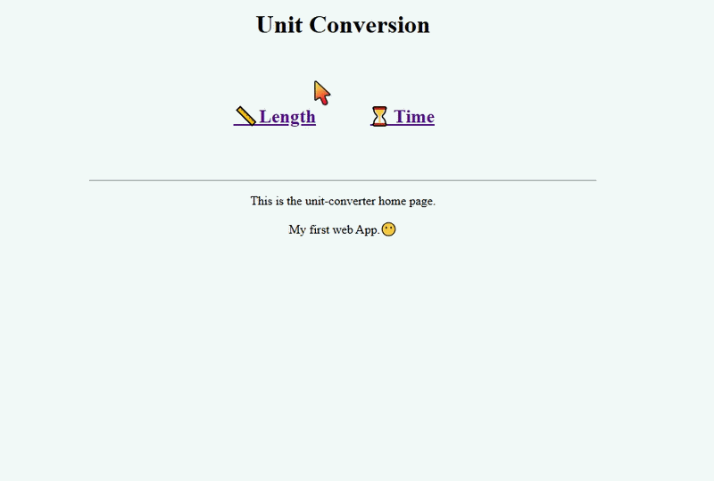

# Unit Converter Web App

A simple unit converter built with Flask that converts Length and Time units.

## Demo



## Features

- 📏 Length conversion (miles, kilometers, feets, meters, etc.)
-  ⏳ Time conversion (Hours, minutes, days, months, years. etc)
- Simple HTML interface
- POST method form handling

## Installation

1. Clone the repository:
```git clone https://github.com/yourusername/unit-converter.git```
- cd unit-converter

2. Create a virtual environment (Optional)
- python -m venv venv

3. Install requirements
- pip install -r requirements.txt

4. Run the app:
- python app.py

5. Open your browser and go to ```http://127.0.0.1:5000```


## Usage
* Click on Lenght or Time from the menu.
* Enter a value
* Select the unit to convert from and to
* Click on `convert`  and you will see the results below it.